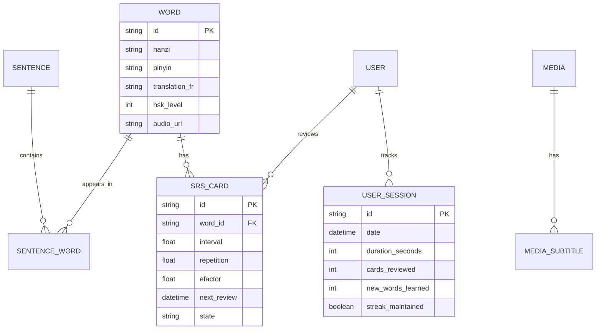
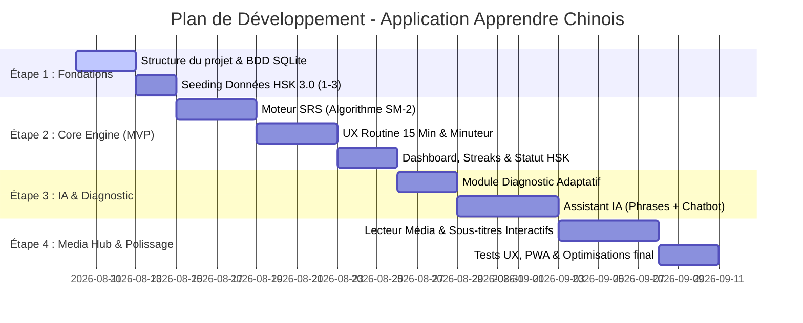

# Synthèse des Avis IA, Cahier des Charges & Plan de Développement : Application Web d'Apprentissage du Mandarin

Ce document rassemble la synthèse comparative des différentes IA (Claude Sonnet 5, GLM 5.2, GPT 5.6, Qwen 3.8, Kimi 2.6), l'analyse d'adéquation avec votre profil, le cahier des charges fonctionnel et technique (PRD) de votre future application web, ainsi que la feuille de route d'ingénierie étape par étape.

---

## 1. Synthèse Comparative des Avis d'IA

### 1.1 Points de Consensus
1. **Priorité Absolue à l'Oral et au Shadowing** : 
   - Toutes les IA s'accordent à dire que l'objectif de vie et de travail en Chine nécessite de concentrer **70% du temps sur l'oral et l'écoute**.
   - La technique du **shadowing** (répéter en temps réel ou juste après un locuteur natif en imitant le ton, le rythme et la diction) est reconnue comme le levier le plus efficace pour débloquer l'oral.
2. **Alignement sur la Norme HSK 3.0 (2026)** :
   - Le cadre officiel HSK 3.0 est unanimement recommandé comme squelette de progression (HSK 1 : 300 mots | HSK 2 : 500 mots | HSK 3 : 1 000 mots | HSK 4 : 2 000 mots | HSK 5 : 3 600 mots).
   - L'oral est désormais obligatoirement intégré à partir du HSK 3, ce qui aligne la préparation HSK avec votre objectif conversationnel.
3. **Optimisation des Sessions de 15 Minutes** :
   - Travailler 15 minutes chaque jour avec régularité surpasse de longues sessions sporadiques.
   - Les sessions doivent suivre un découpage strict : **Révision SRS (4 min) → Rappel de structure (3 min) → Nouveau contenu (5 min) → Production/Shadowing (3 min)**.
4. **Apprentissage par Blocs de Phrases ("Sentence Mining")** :
   - Mémoriser des mots isolés est inefficace. Chaque mot doit être appris au sein d'une phrase modèle utilisable dans la vraie vie (*« Je voudrais commander ce plat »* au lieu de juste *« commander »*).
5. **Rôle des Flashcards et du SRS (Spaced Repetition System)** :
   - L'utilisation du SRS (type algorithme SM-2 / Anki) est indispensable pour garantir une rétention maximale du vocabulaire avec un effort quotidien restreint (5 min/jour).
6. **Horizons Professionnels en Chine** :
   - **HSK 3** : Seuil d'autonomie pour la vie quotidienne.
   - **HSK 4** : Seuil minimum requis par la plupart des entreprises en Chine (réunions simples, e-mails, échanges pro).
   - **HSK 5** : Niveau d'aisance professionnelle complète.

---

### 1.2 Divergences Importantes et Nuances

| Sujet | Option A (Sonnet / GPT / Plan Utilisateur) | Option B (GLM / Kimi / Qwen) | Analyse & Choix Retenu |
|---|---|---|---|
| **Écriture des caractères** | **Reconnaissance uniquement** (Tapping pinyin, lecture, flashcards audio/sens). Pas d'écriture manuscrite. | **Tracé manuscrit quotidien** (Écrire 5 caractères par jour à la main avec l'ordre des traits). | **Option A**. Pour 15 min/jour, l'écriture manuscrite est chronophage et inutile avant le HSK 5. Le focus reste sur le Pinyin et la reconnaissance. |
| **Gestion du redémarrage** | **Diagnostic adaptatif** : Évaluer les restes du HSK 2 pour sauter ce qui est maîtrisé et combler directement les lacunes. | **Reset total (Étape 0)** : Repasser obligatoirement 2 à 4 semaines sur les fondations HSK 1-2 de zéro. | **Option A avec phase de consolidation**. Un test de diagnostic initial identifie les lacunes réelles (tons, structures `是/有/在/了`) sans vous faire perdre de temps. |
| **Input Audio Débutant** | **Comprehensible Input pur** (100% chinois très lent dès le début, ex: Bumpy Chinese). | **Dialogues expliqués** (Podcasts bilingues ou leçons guidées type HelloChinese/Pimsleur). | **Approche Hybride**. Utiliser l'IA pour générer des dialogues guidés avec audio natif + transcript pinyin/FR. |
| **Rôle de l'IA vs Professeurs** | **Tuteurs humains indispensables** (iTalki / HelloTalk dès HSK 3 pour pratiquer). | **Assistant IA intégré dans l'App** (Génération de phrases sur mesure, explication des caractères). | **Synergie**. L'application intègre un assistant IA pour la pratique quotidienne 15 min. L'humain (Tandem/iTalki) intervient en bonus week-end. |

---

## 2. Adaptation sur Mesure à Votre Profil

> [!NOTE]
> **Profil Utilisateur** : Ancien niveau HSK 2 avec lacunes, objectif vie pro/perso en Chine (Shanghai), 15 min/jour, priorité oral/écoute, écrit en soutien (SRS/reconnaissance), contenus culturels (dramas, chansons), assistant IA et suivi par streak.

### Recommandations Clés
1. **Élimination de la charge inutile** : Pas de tracé manuscrit, pas de mémorisation passive d'index HSK hors contexte. Seule la reconnaissance Pinyin + Audio vers le sens est évaluée.
2. **Diagnostic Dynamique au Lancement** : L'application ne vous fait pas reprendre au mot *你好*. Elle propose un quiz adaptatif de 10 minutes qui valide les mots/structures HSK 1-2 déjà ancrés et génère votre plan personnalisé.
3. **Session Quotidienne 15 min Chronométrée** : L'UI guide l'utilisateur pas à pas avec un minuteur intégré pour ne pas dépasser 15 minutes et éviter la fatigue mentale.
4. **Combinaison IA + Media Hub** : L'assistant IA résout le blocage de la production de phrases, tandis que le module média offre des extraits de drames/chansons avec sous-titres interactifs (pinyin, traduction et ajout au SRS en 1 clic).

---

## 3. Cahier des Charges Fonctionnel et Technique (PRD)

### 3.1 Objectifs de l'Application
- **Court terme (Mois 1-3)** : Consolider le HSK 2, combler les lacunes phonétiques/grammaticales, atteindre la survie orale autonome.
- **Moyen terme (Mois 4-8)** : Valider le HSK 3.0 (1 000 mots), tenir des conversations quotidiennes de 5-10 minutes à Shanghai.
- **Long terme (Mois 9-18)** : Atteindre le HSK 4 (2 000 mots), niveau d'employabilité professionnelle.

---

### 3.2 Spécifications des Modules par Priorité

#### 🟢 Priorité 0 — MVP (Core App)
- **Module SRS (Flashcards Espacées)** :
  - Algorithme type SM-2 (Facile / Moyen / Difficile).
  - Mode **Reconnaissance uniquement** : Carte = Audio + Caractère + Pinyin → Révélation de la traduction française et phrase d'exemple.
- **Module Routine 15 Minutes (Séquenceur d'apprentissage)** :
  - Écran unique avec 4 étapes chronométrées :
    1. *SRS Due* (~4 min) : Cartes à réviser.
    2. *Structure du Jour* (~3 min) : Rappel d'un patron de phrase (ex: ` subject + 在 + location + verb`).
    3. *Nouveau Vocabulaire* (~5 min) : 3 à 5 nouveaux mots intégrés dans des phrases modèles avec audio TTS natif.
    4. *Shadowing & Production* (~3 min) : Enregistrement vocal et écoute comparative.
- **Module Dashboard & Gamification** :
  - Suivi de la série de jours consécutifs (Streak), temps total d'étude, nombre de mots maîtrisés par niveau HSK 3.0 (HSK 1, HSK 2, HSK 3).

#### 🟡 Priorité 1 — V2 (IA & Diagnostic)
- **Module Diagnostic Initial** :
  - Quiz adaptatif permettant de tester ~50 mots et structures clés HSK 1-2 pour marquer les cartes comme déjà "Maîtrisées" dans la base SRS.
- **Module Assistant IA (Deux sous-modules)** :
  - **Assistant A — Générateur de Phrases** : Génère des phrases personnalisées selon votre contexte (ex: "génère une phrase avec `预约` adaptée à une réservation à Shanghai").
  - **Assistant B — Chatbot Explicatif de Caractères/Grammaire** : Explication à la demande de l'étymologie, des composants de caractères, des paires tonales et des différences de nuance (ex: différence entre `想` et `Ҫ`).

#### 🔵 Priorité 2 — V3 (Media Hub Audio & Culture)
- **Module Bibliothèque Média** :
  - Lecteur d'extraits courts (dramas, chansons chinoises, dialogues du quotidien).
  - Affichage synchrone des sous-titres (Caractères + Pinyin + Traduction).
  - Mots cliquables : cliquer sur n'importe quel mot dans les sous-titres permet de voir sa définition et de l'ajouter instantanément au deck SRS.

---

### 3.3 Architecture Technique & Modèle de Données

- **Frontend** : Next.js (React), Vanilla CSS / CSS Modules (Design sombre moderne, sobre et réactif).
- **Backend / API** : API Routes Next.js (Node.js).
- **Base de Données** : SQLite avec Prisma ORM (parfait pour application desktop/personnelle légère).
- **IA Provider** : API OpenAI / Gemini API (pour le chatbot et la génération de phrases).
- **Audio Engine** : Web Speech API / Edge TTS / Fichiers audio MP3 officiels HSK.

---

### 3.4 Source des Données de Vocabulaire HSK 3.0

Pour garantir la fiabilité de la base de données sans dépendre d'une API tierce payante ou instable, nous utiliserons un **fichier JSON/CSV local pré-traité et embarqué dans le projet** (seeding SQLite automatique à l'installation).

- **Source principale Open-Source** : Le dataset public [drkameleon/complete-hsk-vocabulary](https://github.com/drkameleon/complete-hsk-vocabulary) combiné à la norme nettoyée [ivankra/hsk30](https://github.com/ivankra/hsk30).
- **Structure des données** : Chaque entrée contient les caractères Hanzi (simplifiés), la transcription Pinyin avec tons, les définitions françaises/anglaises, le niveau officiel HSK 3.0 (1 à 9), la nature grammaticale (POS) et des phrases modèles contextuelles.
- **Gestion de l'Audio** : Utilisation des ressources audio officielles HSK et de l'API native Web Speech / Edge TTS pour assurer la prononciation audio zéro latence.

---

## 4. Roadmap de Développement Étape par Étape

### Détail des Phases de Développement

#### Étape 1 : Structure & Modèle de Données (Jours 1 - 5)
- Initialisation du projet Next.js et de la base de données SQLite via Prisma.
- Création du script d'importation (seeding) des listes officielles HSK 3.0 (HSK 1, 2 et 3) avec Pinyin, Hanzi, traductions françaises et fichiers audio.

#### Étape 2 : Core Engine SRS & Routine Quotidienne (MVP) (Jours 6 - 16)
- Implémentation de l'algorithme de répétition espacée SM-2 pour les flashcards de reconnaissance (Audio/Pinyin → Sens).
- Création du séquenceur de session 15 minutes (Interface utilisateur guidée écran par écran avec minuteur actif).
- Implémentation du système de suivi de série (Streak counter) et du tableau de bord de progression.

#### Étape 3 : Diagnostic Initial & Intégration IA (Jours 17 - 24)
- Développement du test de positionnement adaptatif pour calibrer le niveau de départ sans forcer la repasse du HSK 1.
- Connexion avec l'API IA pour le générateur de phrases personnalisées et le chatbot explicatif de caractères.

#### Étape 4 : Media Hub & Finalisation (Jours 25 - 32)
- Intégration du lecteur multimédia (extraits de dramas et chansons) avec affichage synchrone des sous-titres et extraction SRS en 1 clic.
- Polissage de l'UI (Design sombre moderne, typographie fluide, transitions), recettes fonctionnelles et tests complets.

---

## 5. Prochaines Étapes pour Validation

> [!IMPORTANT]
> **Action attendue de votre part** : Veuillez valider ce cahier des charges et cette synthèse. Dès réception de votre accord sur cette feuille de route, nous passerons à l'exécution de l'**Étape 1** (création du projet Next.js, schéma SQLite et seeding du vocabulaire HSK 3.0).
